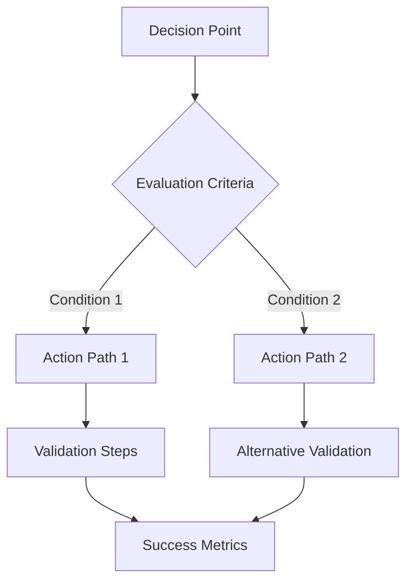

# /wisdom-distillation - High-Level Principle Extraction

Extract high-level principles and decision frameworks from complex technical implementations and historical choices to create reusable wisdom for future decisions.

## Command Signature

```bash
/wisdom-distillation [domain] [--timespan=PERIOD] [--abstraction=LEVEL] [--format=TYPE] [--validate-principles]
```

## Parameters

- `domain`: Technical domain or decision area (architecture, debugging, optimization, team-practices)
- `--timespan=PERIOD`: Historical period to analyze (1month, 6months, 2years, all-time)
- `--abstraction=LEVEL`: Principle abstraction level (tactical, strategic, philosophical, universal)
- `--format=TYPE`: Output format (principles-catalog, decision-tree, mental-model, wisdom-framework)
- `--validate-principles`: Test principles against historical outcomes

## Core Algorithm

### Phase 1: Experience Inventory & Pattern Recognition

**Objective**: Catalog and analyze historical decisions and outcomes

**Process**:
1. **Decision Archaeology**
   - Identify major technical decisions and their contexts
   - Map decision-making processes and criteria used
   - Catalog outcomes and their downstream effects
   - Track evolution of thinking and approach changes

2. **Success Pattern Analysis**
   - Extract patterns from successful implementations
   - Identify conditions that led to positive outcomes
   - Analyze decision-making qualities that worked well
   - Map successful collaboration and communication patterns

3. **Failure Mode Examination**
   - Catalog failures and their root causes
   - Identify early warning signs and red flags
   - Extract lessons learned from difficult experiences
   - Map failure patterns and their prevention strategies

4. **Evolution Trajectory Mapping**
   - Track how approaches and thinking evolved over time
   - Identify learning curves and breakthrough moments
   - Map skill development and capability growth patterns
   - Analyze adaptation strategies for changing contexts

### Phase 2: Principle Extraction & Abstraction

**Objective**: Distill tactical experiences into strategic principles

**Process**:
1. **Pattern Abstraction**
   - Extract underlying principles from successful patterns
   - Identify invariant properties across different contexts
   - Generate abstract rules from concrete implementations
   - Create transferable frameworks from specific solutions

2. **Meta-Principle Discovery**
   - Find principles that govern other principles
   - Identify decision-making meta-strategies
   - Extract learning and adaptation principles
   - Discover collaboration and communication meta-patterns

3. **Context Boundary Analysis**
   - Define where principles apply and where they don't
   - Identify context-dependent variations
   - Map principle interactions and conflicts
   - Create conditional application frameworks

4. **Wisdom Hierarchy Construction**
   - Organize principles by abstraction level and scope
   - Create dependency relationships between principles
   - Build composite frameworks from individual principles
   - Establish priority and precedence rules

### Phase 3: Validation & Refinement

**Objective**: Validate extracted principles against reality

**Process**:
1. **Historical Validation**
   - Test principles against past decisions and outcomes
   - Verify explanatory power for observed patterns
   - Check for counter-examples and edge cases
   - Measure predictive accuracy for historical scenarios

2. **Cross-Domain Validation**
   - Test principle applicability across different domains
   - Verify transferability to new contexts
   - Check for domain-specific adaptations needed
   - Identify universal vs. domain-specific principles

3. **Practical Application Testing**
   - Apply principles to current decision scenarios
   - Test utility in real-world problem-solving
   - Gather feedback from principle application
   - Refine based on practical experience

4. **Principle Evolution Management**
   - Track how principles change with new experience
   - Manage conflicts between old and new insights
   - Update principle hierarchies and relationships
   - Maintain principle genealogy and evolution history

### Phase 4: Wisdom Framework Creation

**Objective**: Package principles into actionable wisdom frameworks

**Process**:
1. **Decision Framework Construction**
   - Create structured approaches to common decisions
   - Build evaluation criteria and trade-off analysis
   - Establish decision trees and flowcharts
   - Include risk assessment and mitigation strategies

2. **Mental Model Documentation**
   - Capture effective ways of thinking about problems
   - Document cognitive strategies and heuristics
   - Create thinking frameworks and methodologies
   - Include bias recognition and correction mechanisms

3. **Principle Catalog Organization**
   - Organize principles by domain and application
   - Create searchable and browsable formats
   - Include examples and counter-examples
   - Provide implementation guidance and tips

4. **Wisdom Integration Protocols**
   - Define how to apply multiple principles together
   - Handle principle conflicts and trade-offs
   - Create adaptation strategies for new contexts
   - Establish learning and update mechanisms

## Distillation Strategies

### Bottom-Up Distillation
Starting from concrete implementations:
- **Implementation Analysis**: Extract patterns from working code
- **Architecture Archaeology**: Understand design decision rationale
- **Debugging Wisdom**: Distill effective troubleshooting approaches
- **Performance Insights**: Extract optimization principles and heuristics

### Top-Down Distillation
Starting from strategic outcomes:
- **Success Decomposition**: Break down successful projects into principles
- **Goal Achievement Analysis**: Understand effective strategy patterns
- **Leadership Insights**: Extract effective team and project management
- **Innovation Patterns**: Distill creative problem-solving approaches

### Cross-Cutting Distillation
Principles that span multiple domains:
- **Quality Philosophy**: What makes software truly excellent
- **Simplicity Principles**: How to manage and reduce complexity
- **Adaptability Frameworks**: How to build for change and evolution
- **Collaboration Wisdom**: How to enhance team effectiveness

## Abstraction Levels

### Tactical Level
Immediate, actionable guidance:
- **Code Patterns**: Specific implementation approaches
- **Debugging Steps**: Systematic troubleshooting procedures
- **Tool Usage**: Effective development environment practices
- **Communication Scripts**: Proven interaction patterns

### Strategic Level
Medium-term planning and architecture:
- **System Design**: High-level architectural principles
- **Technology Choice**: Frameworks for selecting tools and approaches
- **Team Organization**: Effective collaboration structures
- **Project Management**: Successful delivery methodologies

### Philosophical Level
Fundamental beliefs and values:
- **Quality Philosophy**: What constitutes excellent software
- **Simplicity Values**: How to balance features with complexity
- **Growth Mindset**: How to approach learning and capability development
- **Ethical Frameworks**: How to make responsible technical decisions

### Universal Level
Principles that transcend software development:
- **Systems Thinking**: How to understand complex interactions
- **Decision Making**: How to make good choices under uncertainty
- **Communication**: How to effectively share understanding
- **Learning**: How to continuously improve and adapt

## Example Usage

### Architecture Wisdom
```bash
/wisdom-distillation architecture --timespan=2years --abstraction=strategic --format=decision-tree --validate-principles
```

### Debugging Philosophy
```bash
/wisdom-distillation debugging --timespan=all-time --abstraction=philosophical --format=mental-model
```

### Team Effectiveness
```bash
/wisdom-distillation team-practices --timespan=6months --abstraction=tactical --format=principles-catalog
```

## Output Artifacts

### Principles Catalog
```yaml
domain: "Technical Domain"
principles:
  - name: "Principle Name"
    statement: "Clear, actionable principle statement"
    rationale: "Why this principle matters"
    context: "When and where this applies"
    examples:
      positive: "Examples of successful application"
      negative: "Examples of violation consequences"
    confidence: 0.9
    sources: ["historical decisions that led to this principle"]
    
meta_principles:
  - name: "Meta-Principle Name"
    governs: ["principle_names it applies to"]
    statement: "Higher-order principle description"
```

### Decision Tree


### Mental Model
```markdown
# Mental Model: [Domain]

## Core Concepts
- **Key Concept**: Definition and mental representation
- **Relationships**: How concepts interact and influence each other
- **Dynamics**: How the system changes and evolves

## Thinking Strategies
- **Analysis Approach**: How to break down problems
- **Synthesis Method**: How to combine insights
- **Validation Process**: How to verify understanding

## Common Pitfalls
- **Cognitive Biases**: Typical thinking errors in this domain
- **Warning Signs**: Indicators of potential problems
- **Correction Strategies**: How to get back on track

## Application Framework
- **When to Use**: Situations where this mental model applies
- **How to Apply**: Step-by-step application process
- **Adaptation Rules**: How to modify for different contexts
```

### Wisdom Framework
```json
{
  "framework_name": "Wisdom Framework",
  "domain": "Technical Domain",
  "principles": [
    {
      "level": "tactical|strategic|philosophical|universal",
      "principle": "Principle statement",
      "application_context": "When and how to apply",
      "evidence": ["Supporting evidence and examples"],
      "confidence": 0.85
    }
  ],
  "decision_tree": {
    "root_question": "Primary decision criteria",
    "branches": "Decision tree structure",
    "leaf_actions": "Specific recommended actions"
  },
  "validation_methods": [
    "How to test if the framework is working"
  ]
}
```

## Best Practices

1. **Experience Diversity**: Distill from varied experiences and contexts
2. **Counter-Example Awareness**: Actively seek situations where principles don't apply
3. **Confidence Tracking**: Maintain confidence levels for different principles
4. **Evolution Mindset**: Expect principles to evolve with new experience
5. **Context Sensitivity**: Always consider where and when principles apply
6. **Validation Rigor**: Regularly test principles against new situations

## Integration with Other Commands

### Experience Gathering
```bash
/time-machine "src/core" --point-in-time="1 year ago"
/knowledge-graph "architecture decisions" --track-evolution
```

### Principle Application
```bash
/implementation-variants "apply distilled principles"
/pattern-synthesizer "create implementation patterns from principles"
```

### Wisdom Validation
```bash
/context-aware-review "validate principles against current codebase"
/swarm-intelligence "expert review of distilled wisdom"
```

---

**Wisdom distillation transforms experience into reusable intelligence, creating decision frameworks and mental models that accelerate learning and improve decision-making quality across teams and projects.**

🧠⚡∞